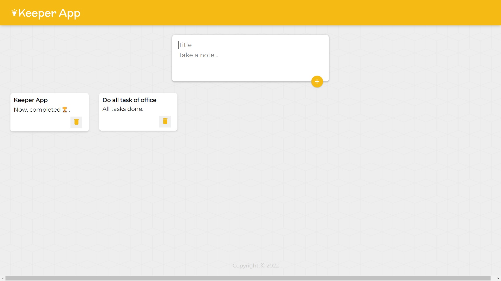

<h1 align="center">Keeper WebApp</h1>

<p align="center">
</p>

<h2 align="center"><a href="https://abhisheksharma1310.github.io/Keeper_app">👆 Clike here for live demo 💻</a></h2>

---

## Description

**Keeper app web application**

<p align="center">
</p>

<h3 align="center">Keeper Web App Desktop View - a live demo</h3>

<p>This keeper webapp is created using ReactJs library.
You can write and save many notes as you wish.
You can also delete them.</p>

---

## Technologies used

- ReactJs

---

## Keeper app Features

- Save Notes with title and details.

- Delete note when you want.

---

## Web App Installation Instructions

- Clone Keeper_app

- Go to project directory

```
git clone https://github.com/abhisheksharma1310/Keeper_app.git
cd Keeper_app/
```

- Install all packages

- Run webapp

```
npm install
npm run start
```

- For build package

```
npm build
```
